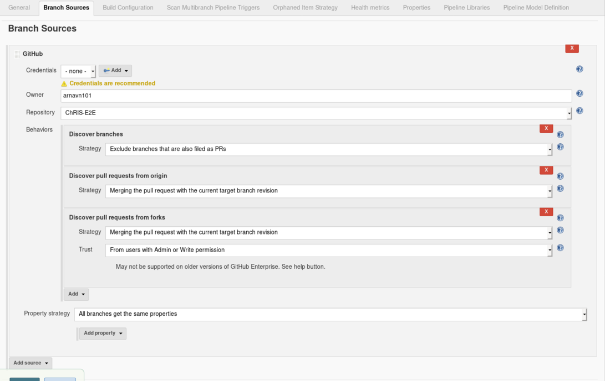

# MOC Health Reporter - v1.0

********
***Overview***
********

This repository provides an application for pfurl project. It sends a generic command from pfurl to send local files to Pfioh, run a sample job on pman, and fetch the files back from pfioh. Overall, it tests all of the core elements of ChRIS Platform with the requirement of only one job id, making the process reentrant. 

- ``MOC Status Reporter``: a program to test the functionality of ChRIS on the MOC
 

MOC Health Reporter
=====

Fundamentally, ``MOC Health Reporter`` is a status fetcher used to send http-based messages to remote services such as ``pman`` and ``pfioh``, in order to test their reliability and response time. 

************
Installation
************

Python Environments
==========================

On any Linux OS, clone this repository and change arguments of config.cfg

      vim config.cfg

Install requirements of Python

     ./install.sh
     
Run the program 
     
     python3 moc-heath-check/automate.py

Jenkins CI 
===============

On any Linux OS, clone this repository and change arguments of config.cfg

      vim config.cfg

Edit JenkinsFile to set time frame for program to run and edit recipients (seperate them by commas or spaces)

     vim Jenkinsfile
     
Commit your changes and configure an email server in your jenkins account
     
     Manage Jenkins > Configure System > Search for “Extended E-mail Notification“
    
[Create jenkins pipeline](https://jenkins.io/doc/pipeline/tour/hello-world)
     
     Click the New Item menu > Provide a name > Select Multibranch Pipeline > Click the Add Source button > Select this Repository
     
    

